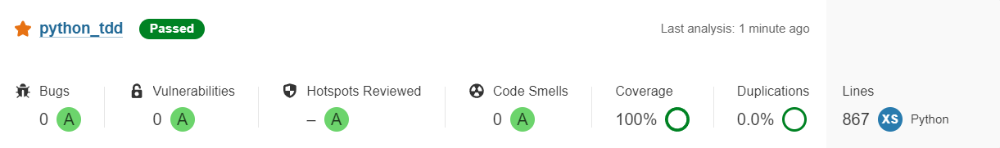

## Python Test Driven Development

<br>

### Test Coverage Report

```
Name                                                    Stmts   Miss  Cover
---------------------------------------------------------------------------
core\__init__.py                                            0      0   100%
core\dependency_injection.py                                4      0   100%
core\services\__init__.py                                   0      0   100%
core\services\sql_service\__init__.py                       0      0   100%
core\services\sql_service\mysql_service.py                 12      0   100%
core\services\sql_service\sql_exception.py                  2      0   100%
core\services\sql_service\sql_service.py                   12      0   100%
core\services\sql_service\tests\__init__.py                 0      0   100%
core\services\sql_service\tests\test_mysql_service.py      65      0   100%
core\services\sql_service\tests\test_sql_exception.py       9      0   100%
core\services\sql_service\tests\test_sql_service.py        53      0   100%
core\tests\__init__.py                                      0      0   100%
core\tests\test_dependency_injection.py                     8      0   100%
features\__init__.py                                        0      0   100%
features\product\__init__.py                                0      0   100%
features\product\models\__init__.py                         0      0   100%
features\product\models\product.py                         26      0   100%
features\product\tests\__init__.py                          0      0   100%
features\product\tests\test_product_crud_usecase.py        17      0   100%
features\product\tests\test_product_model.py               53      0   100%
features\product\tests\test_product_serialization.py       85      0   100%
features\product\usecases\product_crud_usecase.py           7      0   100%
---------------------------------------------------------------------------
TOTAL                                                     353      0   100%
```

<br>

### Sonar Report


